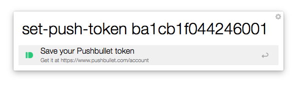

# AlfredBullet

An Alfred 2 Workflow for [Pushbullet][pb]. Written in Go.

[pb]: https://www.pushbullet.com/

## Install

Just install the latest `.alfredworkflow` file from the [GitHub releases][releases] page.

[releases]: https://github.com/matiaskorhonen/alfred-bullet/releases

## Usage

1. Install the workflow (see above)

2. Get your API token from your [Pushbullet account page][account].

3. Set it with the `set-push-token` keyword:

  

4. Enjoy pushing yo your devices:

  

  There is only one keyword/command:

  ```
  push TEXT
  ```

  Where `TEXT` can be a URL or any arbitrary text.

[account]: https://www.pushbullet.com/account

## Build from source

Unless you're planning on working on the source code, you probably down't need to build this from the source.

However, if you do want to build it, this is how:

1. Ensure that you've got a working Go work environment (see [How to Write Go Code][go-how]) with Go 1.4 or above.

2. Clone the repository into your working directory

  ```sh
  git clone git@github.com:matiaskorhonen/alfred-bullet.git \
    $GOPATH/src/github.com/matiaskorhonen/alfred-bullet

  cd $GOPATH/src/github.com/matiaskorhonen/alfred-bullet
  ```

3. Make the Alfred extension with `make workflow`

4. Install the workflow from the `build` directory

[go-how]: http://golang.org/doc/code.html

## License and Copyright

Copyright © 2015 Matias Korhonen.

Licensed under the MIT License, see the [LICENSE.txt](LICENSE.txt) file for details.
